Select a language | 选择语言

[**简体中文**](README_CN.md)  
[**English**](README.md)  

# GL_Commdlg

A C++ header-only library that wraps Windows Common Dialogs and Shell dialogs, providing an easy-to-use UTF-8 API with extended functionality.

## Features

- **Single header** — Just `#include "GL_Commdlg.hpp"`, no extra dependencies
- **UTF-8 API** — All string parameters and return values use UTF-8, no more ANSI/wide encoding headaches!
- **File dialogs** — Open, save, and multi-select file dialogs with custom filters
- **Directory picker** — Directory selection dialog, automatically picks the best API version for the current system
- **Font picker** — Font selection dialog wrapping `ChooseFontW`, with automatic font file path lookup via the registry
- **Prompt dialog** — Custom text input dialog
- **Custom message box** — Message box with user-defined buttons and two display styles
- **Non-blocking dynamic dialogs** — Progress bar, slider, and color picker that run in a separate thread, controllable from the calling thread
    - **Slider dialog** — Non-blocking slider dialog for selecting a numeric value
    - **Progress dialog** — Non-blocking progress bar dialog for monitoring task progress
    - **Color picker** — Non-blocking color picker dialog with HSL colour wheel, HEX/RGB/HSL inputs, alpha support, and screen color picker

## Quick Start

```cpp
#include "GL_Commdlg.hpp"
#include <iostream>

int main() {
    // Open a file dialog
    std::string file = GLDLG::getOpenFileName(
        {"Text Files (*.txt)|*.txt", "All Files (*.*)|*.*"},
        "Select a file"
    );
    if (!file.empty())
        std::cout << "Selected: " << file << std::endl;

    // Message box with custom buttons
    int choice = GLDLG::messageBox(
        "Question",
        "Do you want to continue?",
        {{1, "Yes"}, {2, "No"}}
    );
    std::cout << "You chose: " << choice << std::endl;

    return 0;
}
```

## Building

This is a header-only library — just include the header:

```bash
# MinGW-w64 (requires extra linker flags)
g++ -std=c++20 -Iinclude your_program.cpp -o your_program -lcomdlg32 -lshell32 -lgdi32 -lole32 -luuid -ldwmapi

# MSVC (auto-links via #pragma comment)
cl /std:c++20 /Iinclude your_program.cpp
```

Or use the provided Makefile to build the test:

```bash
mingw32-make test    # Build test/test.cpp
./build/test.exe      # Run tests
```

## API Reference

### File & Directory Dialogs

| Function | Description |
|----------|-------------|
| `getOpenFileName` | Open file dialog, select one existing file |
| `getSaveFileName` | Save file dialog, specify a save path |
| `getOpenMultipleFileNames` | Open file dialog, select multiple files |
| `getOpenDirectoryName` | Folder browser dialog, select a directory |

Filters use `"Description|Pattern"` format. Multiple patterns are separated by `;`:

```cpp
auto file = GLDLG::getOpenFileName({
    "Text Files (*.txt)|*.txt",
    "Images (*.png;*.jpg)|*.png;*.jpg",
    "All Files (*.*)|*.*"
});
```

All functions accept optional parameters: `title`, `initialDir`, `defaultFileName`, `defaultExt`, and `parentHWND`.

| Dialog | Preview |
|--------|---------|
| Open File | 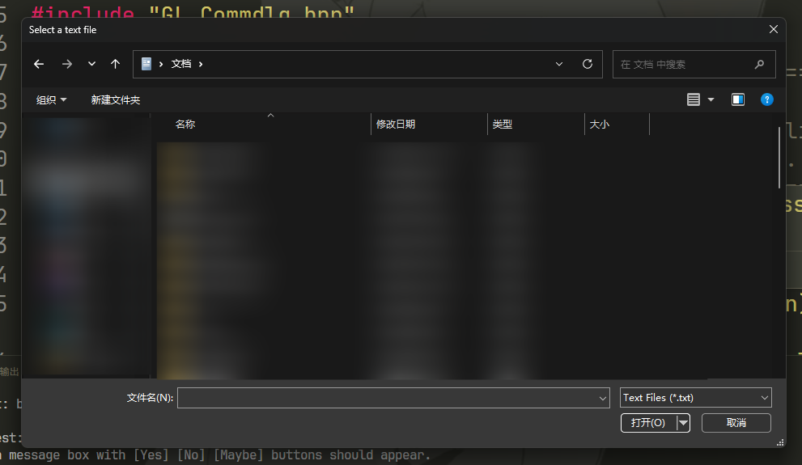 |
| Save File | 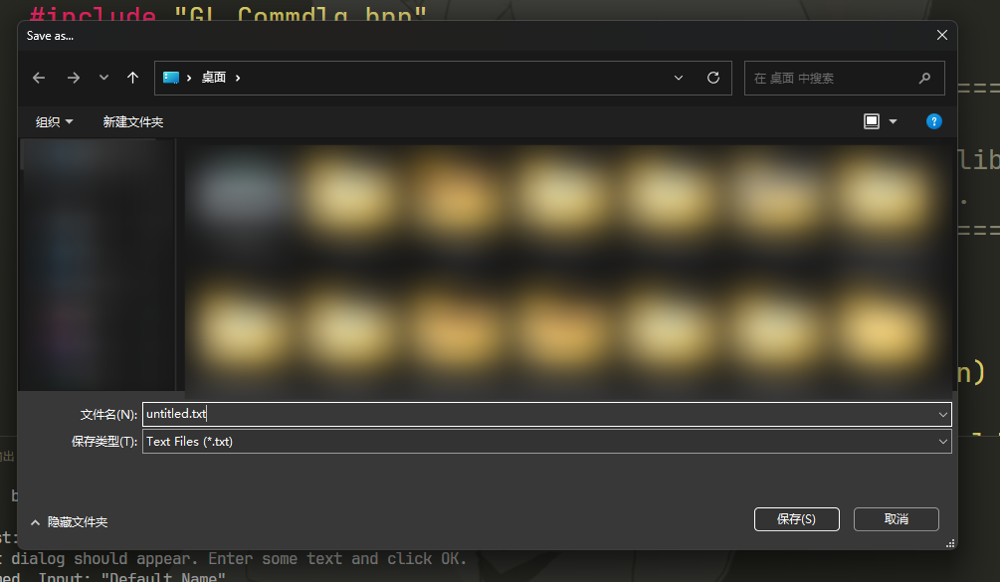 |
| Browse Folder | 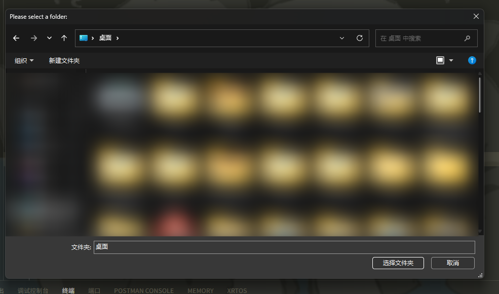 |

### Font Picker

```cpp
GLDLG::chooseFontInfo cfi;
GLDLG::chooseFont(cfi);
// cfi.fontFaceName  — e.g. "Arial"
// cfi.fontPointSize — e.g. 12
// cfi.fontPath      — e.g. "C:\\Windows\\Fonts\\arial.ttf"
//                    (may be empty if the font file is not found)
```

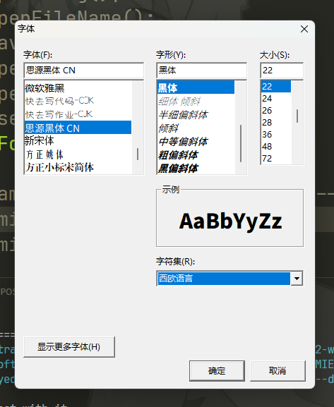

### Prompt Dialog

```cpp
std::string input;
bool confirmed = GLDLG::promptDialog("Input", "Enter your name:", input, "Default Name");
if (confirmed) {
    // input contains the entered text
}
```

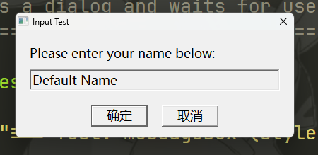

### Custom Message Box

```cpp
int result = GLDLG::messageBox(
    "Title",
    "Message text.",
    {{10, "OK"}, {20, "Cancel"}, {30, "Help"}},
    NULL,       // parent HWND
    0           // style: 0 = GDI rendered (word wrapping), 1 = EDIT control
);
// Returns the clicked button's key, 0 if closed, -1 if options is empty
```

Style 0 uses GDI `DrawTextW` with `DT_WORDBREAK` — the dialog auto-sizes to fit the text.

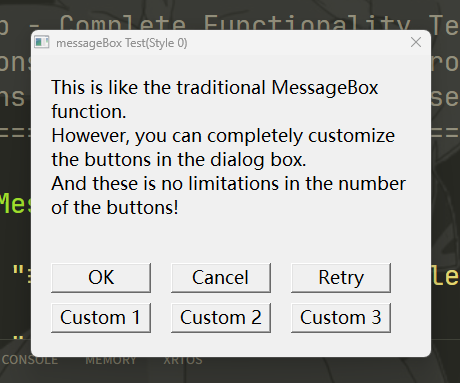

Style 1 uses a multi-line EDIT control with auto-scroll — suitable for long messages.

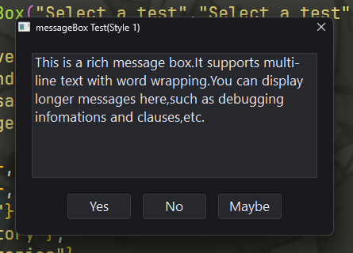

## Dynamic (Non-blocking) Dialogs

Dynamic dialogs run in a **separate thread**, so they never block the calling code. They are controlled through a movable, non-copyable RAII interface that automatically cleans up on destruction.

### DynamicProgressBar

```cpp
auto bar = GLDLG::CreateDynamicProgressBar("Progress", "Working...");

for (int i = 0; i <= 100; i += 10) {
    bar.SetValue(i, 100, std::to_string(i) + "%");
    std::this_thread::sleep_for(std::chrono::milliseconds(200));
}

bar.Close();  // or let the destructor handle it
```

| Method | Description |
|--------|-------------|
| `SetValue(current, max, message)` | Update progress value and text |
| `GetProgressInfo(current, max, message, percent)` | Read current state |
| `Show()` / `Close()` | Show or close the dialog |
| `IsFinished()` | Check if the dialog has been closed |

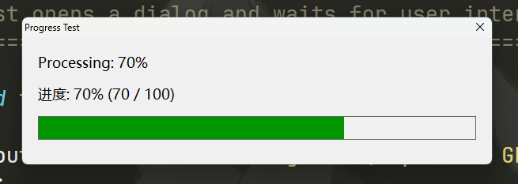

### DynamicSlider

```cpp
auto slider = GLDLG::CreateDynamicSlider(
    "Volume", "Adjust the volume:", 0, 100, 50,
    [](GLDLG::DynamicSliderCallbackMessageType type, int value) -> int {
        return value;  // optionally modify or clamp
    }
);

while (!slider.IsFinished()) {
    std::this_thread::sleep_for(std::chrono::milliseconds(100));
}

int cur, min, max;
std::string msg;
slider.GetSliderInfo(cur, min, max, msg);
```

| Method | Description |
|--------|-------------|
| `SetValue(value)` | Set current value |
| `SetRange(min, max)` | Set slider range |
| `SetCallback(cb)` | Set value-change callback |
| `GetSliderInfo(current, min, max, message)` | Read current state |
| `Show()` / `Close()` | Show or close the dialog |
| `IsFinished()` | Check if the dialog has been closed |
| `IsDragging()` | Check if the user is dragging the thumb |

The callback receives a `DynamicSliderCallbackMessageType` (`Dragging` or `Released`) and the current value; it can return a modified value.

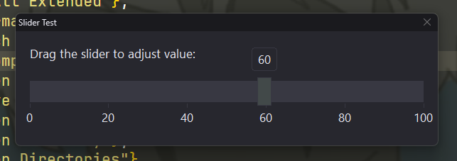

### DynamicColorPicker

```cpp
auto picker = GLDLG::CreateDynamicColorPicker("Pick a Color", {255, 0, 0});

while (!picker.IsFinished()) {
    std::this_thread::sleep_for(std::chrono::milliseconds(100));
}

GLDLG::ColorRGBA color = picker.GetColor();
```

| Method | Description |
|--------|-------------|
| `GetColor()` | Get the current color (returns `ColorRGBA`) |
| `SetCallback(cb)` | Set a callback for color change events |
| `Show()` / `Close()` | Show or close the dialog |
| `IsFinished()` | Check if the dialog has been closed |

> The eyedropper button (`Pick`) lets you pick a color from anywhere on the screen.

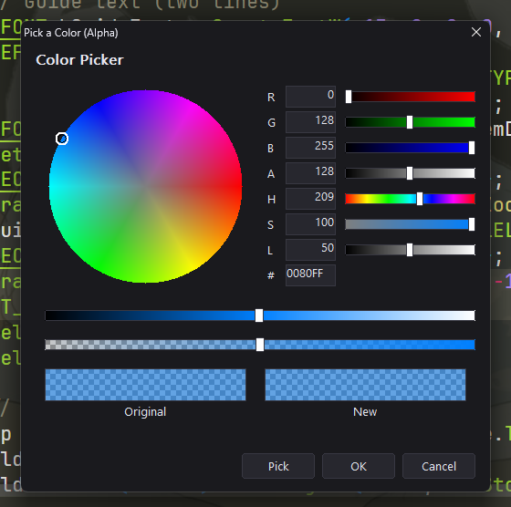
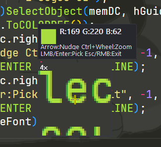

## Theme Customization

The entire extended UI uses a unified dark color scheme defined by the `GLDLG::Theme` struct. You can query or override it at runtime:

```cpp
// Get current theme
const auto &t = GLDLG::GetTheme();

// Set custom theme (ColorRGBA values)
GLDLG::SetTheme({
    {230, 230, 239},   // Text           — #E6E6EF
    {56,  56,  66},    // ControlFrame   — #383842
    {26,  26,  30},    // PrimaryBackground  — #1A1A1E
    {39,  39,  46},    // SecondaryBackground — #27272E
    {66,  73,  73},    // PrimaryForeground   — #424949
    {72,  84,  102}    // SecondaryForeground — #485466
});
```

| Token | Default | Used For |
|-------|---------|----------|
| `Text` | `#E6E6EF` | Labels, control text |
| `ControlFrame` | `#383842` | Borders of all controls |
| `PrimaryBackground` | `#1A1A1E` | Dialog window background |
| `SecondaryBackground` | `#27272E` | Control interior |
| `PrimaryForeground` | `#424949` | Button hover state |
| `SecondaryForeground` | `#485466` | Disabled state |

## Project Structure

```
GL_Commdlg/
├── demo/
│   ├── select_file.png      # Screenshots demonstrating each dialog
│   ├── save_file.png
│   ├── select_directory.png
│   ├── pick_color.png
│   ├── pick_font.png
│   ├── prompt.png
│   ├── message_box_style_0.png
│   ├── message_box_style_1.png
│   ├── progress_bar.png
│   └── slider.png
├── include/
│   ├── GL_Commdlg.hpp            # Main header — the whole library
│   ├── GL_Commdlg_Native.hpp     # Native Win32 common dialog wrappers
│   ├── GL_Commdlg_Extended.hpp   # Extended custom dialogs & controls
│   └── UTF8toWide.hpp            # UTF-8 / wide string conversion helpers
├── test/
│   └── test.cpp             # Test program (exercises all APIs)
├── Makefile                 # Build script (MinGW-w64)
├── CONTROLS.md              # Internal controls reference (EN)
├── CONTROLS_cn.md           # Internal controls reference (CN)
├── LICENSE                  # License file
├── README.md                # English documentation
└── README_cn.md             # Chinese documentation
```

## Reuse Controls

If you'd like to use the internal controls (`Button`, `Edit`, `Tooltip`) in your own projects, see [`CONTROLS.md`](CONTROLS.md) for the full documentation.

## License

This software is provided 'as-is', without any express or implied warranty.
See the [LICENSE](LICENSE) file for full details.

Copyright (c) 2026 Gao Li

